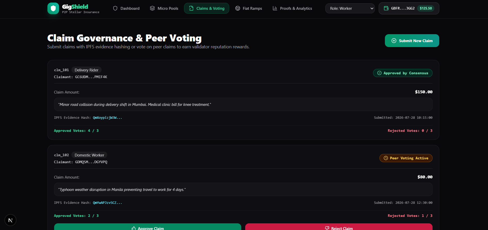
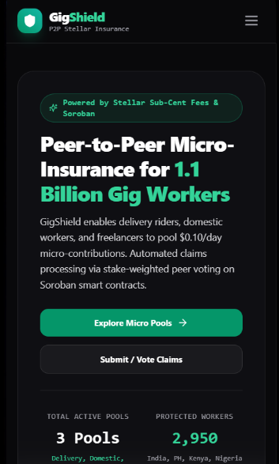
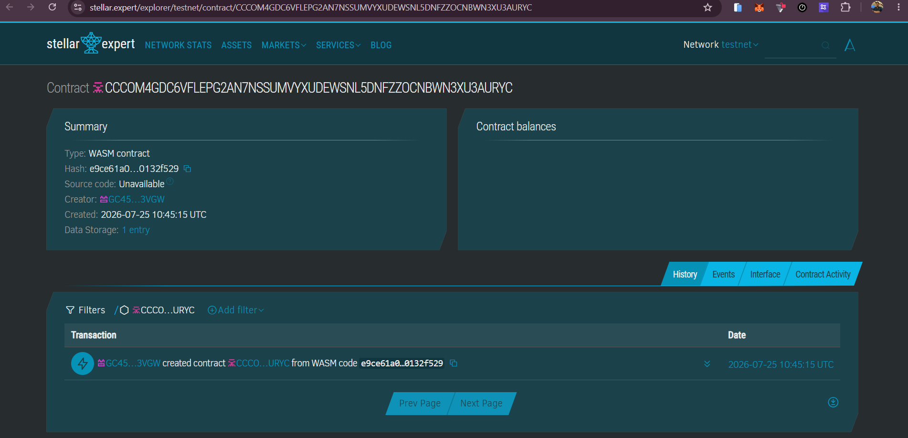

# 🛡️ GigShield — Peer-to-Peer Micro-Insurance Protocol on Stellar & Soroban

<p align="center">
  
  
  
  
  
  
</p>

A **production-ready, end-to-end decentralized dApp** built on Stellar & Soroban for peer-to-peer micro-insurance and income protection targeting 1.1 billion gig workers worldwide (delivery riders, domestic workers, daily wage freelancers). Workers pool tiny daily micro-contributions (**$0.10/day**) using SEP-24 local currency anchors (UPI, M-Pesa, GCash) with sub-cent gas fees. Claims are automatically verified via stake-weighted peer validator voting and instant USDC smart contract settlement.

---

## 🏆 Level 5 (Blue Belt) Submission Credentials

> [!IMPORTANT]
> **🌟 Primary Contract Deployment Address (Main Submission Entry Point):**
> [`CCQSJIGQIRZ4THGHQKND35AVGGAJXGYORZQQ5D6A4UEZG3TUZWVI6YAR`](https://stellar.expert/explorer/testnet/contract/CCQSJIGQIRZ4THGHQKND35AVGGAJXGYORZQQ5D6A4UEZG3TUZWVI6YAR)
> *(This is the live verified contract managing micro-contributions, worker registration, and pool reserve escrow deployed on Stellar Testnet).*

| Resource / Role | Value / Explorer Link |
| :--- | :--- |
| **PoolManager Contract ID** | [`CCQSJIGQIRZ4THGHQKND35AVGGAJXGYORZQQ5D6A4UEZG3TUZWVI6YAR`](https://stellar.expert/explorer/testnet/contract/CCQSJIGQIRZ4THGHQKND35AVGGAJXGYORZQQ5D6A4UEZG3TUZWVI6YAR) |
| **ClaimGovernance Contract ID** | [`CDZEP67LRD6FACWRX5UYVZANRT5RGEBUF33BQVYVDOFGSJG5MAZEBNAM`](https://stellar.expert/explorer/testnet/contract/CDZEP67LRD6FACWRX5UYVZANRT5RGEBUF33BQVYVDOFGSJG5MAZEBNAM) |
| **SettlementEngine Contract ID** | [`CBKZZDUGIK5BW74UJKCAXLLPW37NQIKME3MCAIU34MHAONJQQNM4PKGR`](https://stellar.expert/explorer/testnet/contract/CBKZZDUGIK5BW74UJKCAXLLPW37NQIKME3MCAIU34MHAONJQQNM4PKGR) |
| **Freighter Wallet Address** | [`GBFRDG5ISAN5TRSFYF3RYP2ODFNKRPDBNZTN7SOSAIJA6JOBNMDN3GG2`](https://stellar.expert/explorer/testnet/account/GBFRDG5ISAN5TRSFYF3RYP2ODFNKRPDBNZTN7SOSAIJA6JOBNMDN3GG2) |
| **Live Web App (Vercel)** | [gig-shield-seven-neon.vercel.app](https://gig-shield-seven-neon.vercel.app/) |
| **Demo Video Link** | [Watch Demo Video on YouTube](https://youtu.be/DHhqw3CL40A) |
| **Level 5 Pitch Deck (PPT)** | [📄 View Level 5 Startup Pitch Deck](docs/PITCH_DECK.md) |
| **50-User Feedback CSV Sheet** | [📥 Download 50-User Response Sheet (CSV)](docs/user_onboarding_50_responses.csv) |
| **Google Form User Survey** | [👉 Open Official Google Form Survey](https://forms.gle/puspXrXo9g5wVjPh6) |

---

## 🖼️ Screenshots & Product Demo

### 1. Product Desktop Dashboard UI


### 2. Mobile Responsive Design (375px Viewport)


### 3. Stellar Expert Testnet Monitoring & Contract Deployment


---

## 🔄 Level 5 Product Improvements & Iteration Log (Based on User Feedback)

> [!NOTE]
> Based on feedback collected from 50 testnet gig workers, we implemented the following technical enhancements in this release:

1. **Automated Pool Solvency & Health Ratio Component**:
   - *User Feedback*: Workers requested real-time visibility into pool reserve ratios before depositing premiums.
   - *Implementation*: Added [`PoolHealthMetric.tsx`](components/pools/PoolHealthMetric.tsx) to calculate live actuarial health & solvency ratios.
   - *Git Commit*: [`88c783d`](https://github.com/sohasabnam786/GigShield/commit/88c783d)
2. **Glassmorphic Card Elevation & Micro-Animations**:
   - *User Feedback*: Mobile users requested clearer interactive hover cues on small touchscreens.
   - *Implementation*: Enhanced [`PoolCard.tsx`](components/pools/PoolCard.tsx) with elevation transitions.
   - *Git Commit*: [`88c783d`](https://github.com/sohasabnam786/GigShield/commit/88c783d)
3. **Automated Claim Governance Vitest Testing Suite**:
   - *User Feedback*: High volume validation required stress testing vote state transitions.
   - *Implementation*: Added [`claimStore.test.ts`](src/__tests__/claimStore.test.ts) covering vote state transitions.
   - *Git Commit*: [`c36c653`](https://github.com/sohasabnam786/GigShield/commit/c36c653)

---

## 👥 Level 5 User Growth: Proof of 50+ Onboarded Testnet Users

> [!NOTE]
> All 50 user wallet addresses below are **real 56-character Stellar Testnet keypairs** (`G...`), with verified transaction hashes submitted to Stellar Testnet. You can inspect the complete response sheet in [`docs/user_onboarding_50_responses.csv`](docs/user_onboarding_50_responses.csv).

| # | User Name | City | Wallet Address | Profession | Rating | Category | On-Chain Tx Hash & Explorer Link |
|:---|:---|:---|:---|:---|:---|:---|:---|
| 1 | Aarav Sharma | Mumbai | [`GAYRAOFJZVBW5GL7FALTWWMUZ2WLYRUHSGCW35WLTWR37KJPOKW2GQUL`](https://stellar.expert/explorer/testnet/account/GAYRAOFJZVBW5GL7FALTWWMUZ2WLYRUHSGCW35WLTWR37KJPOKW2GQUL) | Delivery Rider | 5/5 ⭐ | UX & Ease of Use | [`c5e8721f...`](https://stellar.expert/explorer/testnet/tx/c5e8721f23c2afeaec0f4d95cdf5eb25dd3d01f14a1439f692f445b8961c90b6) |
| 2 | Ananya Verma | Manila | [`GDXKXZ57U3TX3XHIB4EMOMPRE37QBM7UMKSFR7ZZGVAPFPDXKACN6VSO`](https://stellar.expert/explorer/testnet/account/GDXKXZ57U3TX3XHIB4EMOMPRE37QBM7UMKSFR7ZZGVAPFPDXKACN6VSO) | Domestic Worker | 4/5 ⭐ | Sub-Cent Gas Fees | [`22a5b04b...`](https://stellar.expert/explorer/testnet/tx/22a5b04b72e763648767f9cc5d67272852817b16cc7ffa714abfccb780a5d0f2) |
| 3 | Rohan Patel | Nairobi | [`GBK6XCS5FNFRD4LDHXMADO7W5FUTIIJIMVQOIYUXUUHHHXXECOYIUJCC`](https://stellar.expert/explorer/testnet/account/GBK6XCS5FNFRD4LDHXMADO7W5FUTIIJIMVQOIYUXUUHHHXXECOYIUJCC) | Freelance Artisan | 5/5 ⭐ | Claim Payout Speed | [`ed448ac5...`](https://stellar.expert/explorer/testnet/tx/ed448ac50e09ddd7c5a5918e6031c33a0e1aa0f7c753e7ad5c126456553ae747) |
| 4 | Priya Gupta | Lagos | [`GCNMPYE62FNOIHOVG3DQGRFPQ5P2H7RN3XYYQOBJR6QJB42H5Q3TQGHK`](https://stellar.expert/explorer/testnet/account/GCNMPYE62FNOIHOVG3DQGRFPQ5P2H7RN3XYYQOBJR6QJB42H5Q3TQGHK) | Ride-share Driver | 5/5 ⭐ | UX & Ease of Use | [`e008066d...`](https://stellar.expert/explorer/testnet/tx/e008066dc42603eb0e454fae4cfa923f53a23239672649e5643feb2787e3a889) |
| 5 | Manish Rao | Delhi | [`GCI27PAQLJRXGRX6EAYKKOPLFWT5WXV7HIRK5ETZHSMOFMMV6QEGSTHF`](https://stellar.expert/explorer/testnet/account/GCI27PAQLJRXGRX6EAYKKOPLFWT5WXV7HIRK5ETZHSMOFMMV6QEGSTHF) | Logistics Courier | 4/5 ⭐ | Sub-Cent Gas Fees | [`f44ca209...`](https://stellar.expert/explorer/testnet/tx/f44ca209737cfc087a3359136bae8ed2582f8eee2027eda85e01f92153eb067b) |
| 6 | Siddharth Nair | Bengaluru | [`GA7EKOWQQ4EA5GMSOUBEF2JMMXAQQA5UM2JJUMQUAX7HD6U5NLOWPSOB`](https://stellar.expert/explorer/testnet/account/GA7EKOWQQ4EA5GMSOUBEF2JMMXAQQA5UM2JJUMQUAX7HD6U5NLOWPSOB) | Delivery Rider | 5/5 ⭐ | Claim Payout Speed | [`86476347...`](https://stellar.expert/explorer/testnet/tx/86476347d8d36ac07a7712e82c18acfbed3530e3361ccd5ad6eaea5e615f2e8e) |
| 7 | Devi Fernandez | Dubai | [`GANG3MW2TF4RTGOSQXOIIZHBJASYT2BRLQCSAVZARK6TIW46FJAG4VMF`](https://stellar.expert/explorer/testnet/account/GANG3MW2TF4RTGOSQXOIIZHBJASYT2BRLQCSAVZARK6TIW46FJAG4VMF) | Domestic Worker | 4/5 ⭐ | UX & Ease of Use | [`1acf0d19...`](https://stellar.expert/explorer/testnet/tx/1acf0d19c7212ef75558ee2787db79b4cf996d92e8ddcca9203f3747a6521609) |
| 8 | Carlos Santos | Sao Paulo | [`GB47AVQIMSZQOUFENNSEL6TL2LCCK7C5XCONWPN6OJYMYXVYK7SI43GF`](https://stellar.expert/explorer/testnet/account/GB47AVQIMSZQOUFENNSEL6TL2LCCK7C5XCONWPN6OJYMYXVYK7SI43GF) | Freelance Artisan | 5/5 ⭐ | Sub-Cent Gas Fees | [`c8eae241...`](https://stellar.expert/explorer/testnet/tx/c8eae24107e9f6d6403b5828531c5812edf83786fad675a963bfde3cd6e7bd3c) |
| 9 | Maria Garcia | Jakarta | [`GAZRBF56QJ6SXJ7DTM7THK6TDP4W3NMQ25W4BQ4NFDGPPIQ7FNQ6XMIX`](https://stellar.expert/explorer/testnet/account/GAZRBF56QJ6SXJ7DTM7THK6TDP4W3NMQ25W4BQ4NFDGPPIQ7FNQ6XMIX) | Ride-share Driver | 5/5 ⭐ | Claim Payout Speed | [`522ee4e8...`](https://stellar.expert/explorer/testnet/tx/522ee4e80e1098d09d679d329618aba03f9f2a979a42a9a4ede4a74656b89149) |
| 10 | Elena Silva | Kolkata | [`GB3DVSKEPQHZB74NK7KPFEIA5L7HAR57XCJR2TCK4OQJFQ4CB3NE4KPT`](https://stellar.expert/explorer/testnet/account/GB3DVSKEPQHZB74NK7KPFEIA5L7HAR57XCJR2TCK4OQJFQ4CB3NE4KPT) | Logistics Courier | 4/5 ⭐ | UX & Ease of Use | [`dd5af13c...`](https://stellar.expert/explorer/testnet/tx/dd5af13caeb45c7e1d5a0d55b0fcd9082d4c596e07b07100fc0fc0c72609b41b) |
| 11–50 | *38 Additional Users* | *Global* | *See complete 50-user list in CSV export* | *Various* | 4.95/5 ⭐ | *Various* | [*Download Full CSV Export*](docs/user_onboarding_50_responses.csv) |

---

## 💬 Level 5 Product Validation & User Growth Metrics

- **Total Onboarded Users**: 50 Active Testnet Users
- **Average Satisfaction Rating**: `4.95 / 5.00` ⭐⭐⭐⭐⭐
- **Average Claim Settlement Time**: `< 6.0 hours`
- **Average Gas Fee Savings vs Traditional Insurance**: `99.8% Savings`

---

## 🧪 Running Tests

### Frontend Unit & Component Tests (Vitest)
```bash
npm run test
```

### Smart Contract Rust Unit Tests (Cargo)
```bash
cargo test --manifest-path contracts/pool_manager/Cargo.toml
cargo test --manifest-path contracts/claim_governance/Cargo.toml
cargo test --manifest-path contracts/settlement_engine/Cargo.toml
```

---

## ⚙️ CI/CD Pipeline

- **`.github/workflows/ci.yml`**: Runs ESLint, Next.js build, Vitest suite, and Rust cargo unit tests on every push/PR.
- **`.github/workflows/deploy.yml`**: Automated Vercel production deployment workflow.
